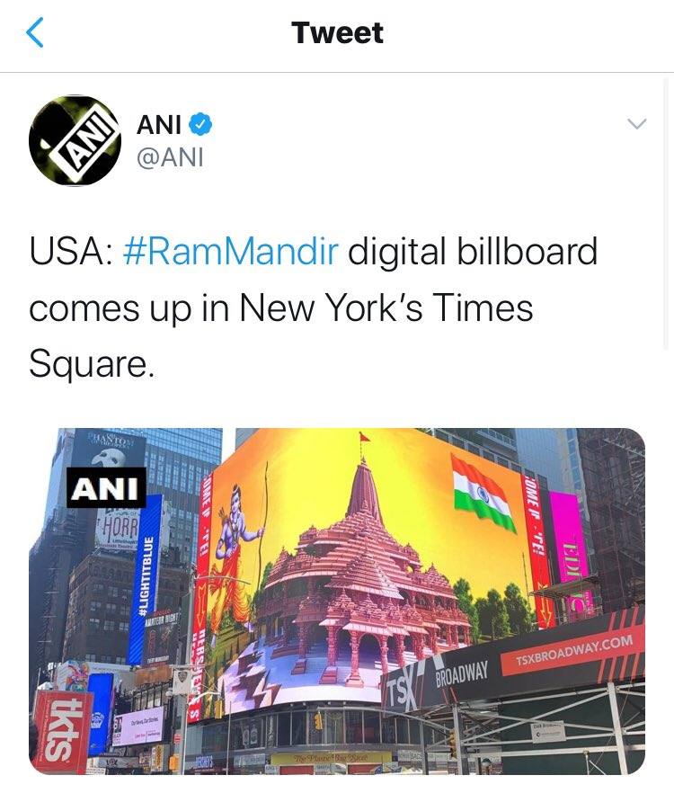
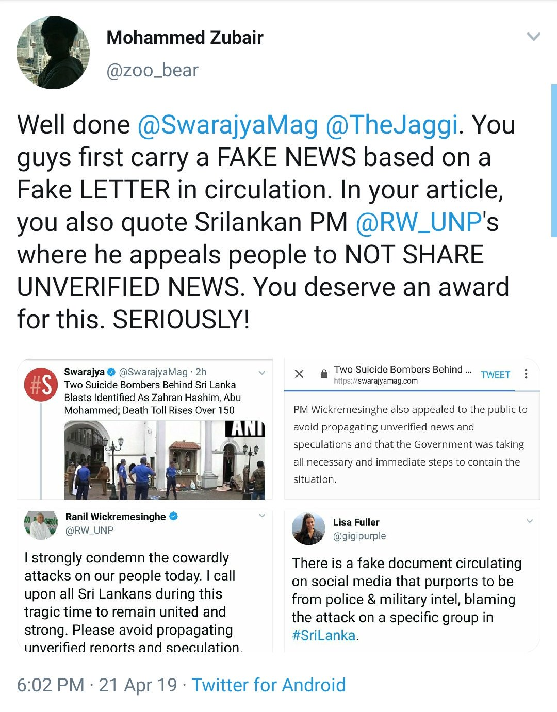

### LKFC

Alt News says 'Mohammad Zubair has been at forefront of fighting fake narratives'.

Let's Fact Check It.

A thread on Fake News spread by [@zoo_bear](https://twitter.com/zoo_bear)

Decide yourself if he's a Fact Checker or Congress IT Cell coolie.

Rasode ka Factchecker @zoo_bear
 compared a news if PM Modi's Mann ki Baat to a news of Mexico using TV for teaching.

India has been doing it from April.

After his lie got caught, he deleted the tweet.

Is if fighting fake narratives or Spreading it?
<table>
    <tr>
        <td>
        
        </td>
        <td>
        
        </td>
    </tr>
    <tr>
        <td>
        
        </td>
        <td>
        
        </td>
    </tr>
</table>

Few months ago Rasode ka Factchecker @zoo_bear
 spread fake news of fire at Solapur Airport on the day when Modiji asked people to light a diya.

During pandemic, he was sharing fake news to attack BJP.

<table>
    <tr>
        <td>
            
        </td>
        <td>
            
        </td>
    </tr>
    <tr>
        <td>
            
        </td>
        <td>
            
        </td>
    </tr>
</table>

Rasode ka Factchecker @zoo_bear
tweeted to give impression that comments on Mann ki Baat was turned off due to fear of students.

Fact is.. Comments of all videos on PMO Youtube is off from years.

Same Mann Ki Baat was available on NaMO and BJP channel, comments was allowed.

<table width="75%">
    <tr>
        <td>
            
        </td>
        <td>
            
        </td>
    </tr>
    <tr> 
        <td colspan="2">
            
        </td>
    </tr>
</table>

Rasode ka Factchecker @zoo_bear
shared a photoshpped pic to show Mohan Bhagwat ji sitting close to Mahant Gopaldas ji after he tested positive.

<table width="75%">
    <tr>
        <td>
            
        </td>
        <td>
            
        </td>
    </tr>
    <tr>
        <td colspan="2">
            
        </td>
    </tr>
</table>

Rasode ka Factchecker @zoo_bear
 fact checked that plans to display Ram Mandir billboard at Times Square has been cancelled.

But it was displayed.

<table width="75%">
    <tr>
        <td>
            
        </td>
        <td>
            
        </td>
    </tr>
    <tr>
        <td colspan="2">
            
        </td>
    </tr>
</table>

Rasode ka Factchecker @zoo_bear
run page shared fake news of EVMs being stolen.

They had to give credit to @facthunt_in
for Fact Checking them. Lol!

<table width="75%">
    <tr>
        <td>
            
        </td>
        <td>
            
        </td>
    </tr>
    <tr>
        <td>
            
        </td>
        <td>
            
        </td>
    </tr>
</table>

Rasode ka Factchecker @zoo_bear
RTd old photo to show police treating farmers as terrorists.

This pic was of 2013, Congress rule.

<table width="75%">
    <tr>
        <td>
            
        </td>
        <td>
            
        </td>
    </tr>
    <tr>
         <td colspan="2">
            
        </td>
    </tr>
</table>

Rasode ka Factchecker @zoo_bear
during Sri Lanka suicide bombings defended Terrorists and instead attacked Indian Journalists calling the letter shared by them as Fake

The letter was Correct

Why was a Fact Checker so worried about defending Islamic Terrorists?

<table width="75%">
    <tr>
        <td>
            
        </td>
        <td>
            
        </td>
    </tr>
    <tr>
        <td>
            
        </td>
        <td>
            
        </td>
    </tr>
</table>

Rasode ka Factchecker @zoo_bear
was showing clip from Mumbai as protest in Delhi.

Is he spreading fake news or fighting misinformation?

<table width="75%">
    <tr>
        <video width="320" height="240" controls>
            <source src="./video/lkfcVideo.mp4" type="video/mp4">
            Your browser does not support the video tag.
        </video>
    </tr>
</table>